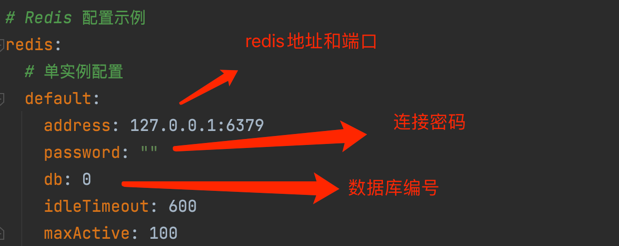

# uu-gfast 快速开发脚手架

## 平台简介

* 在gfast框架的基础上，增加了自动生成代码的功能，只需要写好sql并写入到数据库，即可自动生成前后端代码。

## 快速开始
* 初始化

`go mod tidy`

* 等待go.mod都不再报红，开发工具建立索引结束。如果仍然有报错，可以使用鼠标移动到报错位置，出现提示后，点击 sync.....

* 查看配置文件，`manifest/config`下的yaml文件。
  - config.yaml:开发环境配置
  - config-prod.yaml:生产环境配置
  - config-test.yaml:测试环境配置

* 修改配置文件中关于数据库的配置、redis的配置、缓存配置以及自动化代码配置
    - 数据库配置:

    

    - redis配置:

    

    - 缓存配置:

    

    - 自动化代码配置:

    

* 创建数据库并复制sql脚本文件中的sql语句，`resource/data/gfast-v32.sql`，在Navicat创建一个查询后，粘贴执行即可。

* 运行项目

在main.go文件，右键点击Debug。出现以下日志，则运行成功
